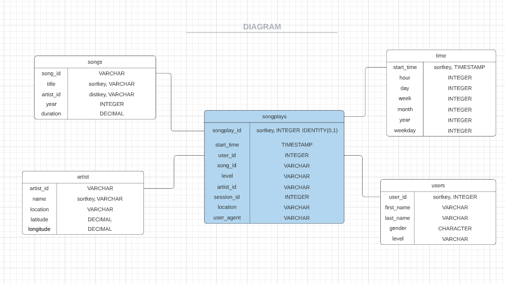
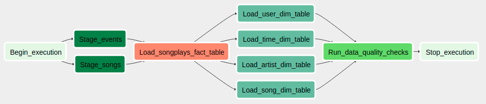

# Data Pipelines with Airflow

## Purpose
A music streaming company has decided that they need more automation and want to monitore their data warehouse ETL pipelines using Apache Airflow. In this project, we will build data pipelines using Apache Airflow using custom defined operators to perform tasks such as staging the data, filling the data warehouse, and running checks on the data as the final step.

## Database schema
The Star Database Schema (Fact and Dimension Schema) is used for data modeling in this ETL pipeline. There is one fact table containing all the metrics (facts) associated to each event (user actions), and four dimensions tables, containing associated information such as user name, artist name, song meta-data. 

## DAG structure

- The DAG does not have dependencies on past runs
- DAG has schedule interval set to hourly
- On failure, the task are retried 3 times
- Retries happen every 5 minutes
- Catchup is turned off
- Email are not sent on retry

## Project structure
* dags - DAGs and subDAGs 
* plugins/helpers - SQL helper class for easy querying
* plugins/operators - operator to perform the DAG tasks
* create-table.sql - SQL commands to create tables on Redshift
* README - current file
* schema - image storage